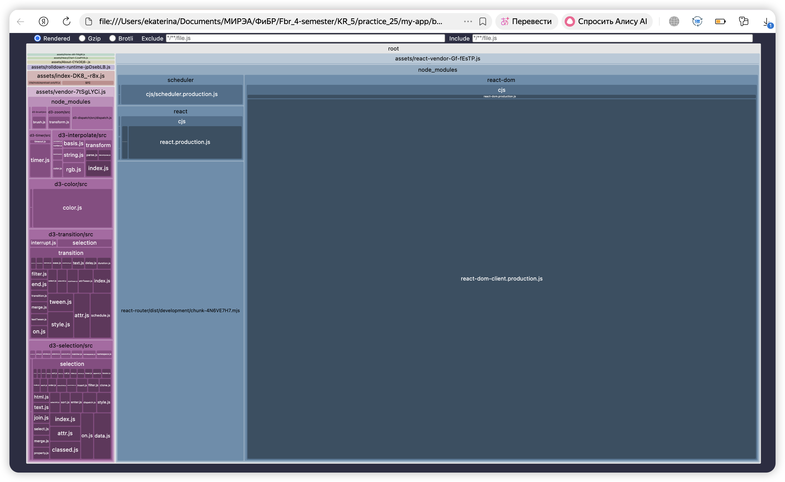

# Практическая работа №25

## Цель работы

Освоить современные инструменты сборки фронтенд-приложений и техники оптимизации бандла:
- Code Splitting (разделение кода)
- Lazy loading (ленивая загрузка)
- Tree-shaking (удаление мёртвого кода)
- Анализ размера бандла

## Используемые технологии

| Технология | Назначение |
|------------|------------|
| **React 19** | Библиотека для пользовательских интерфейсов |
| **Vite** | Инструмент сборки (быстрее Webpack) |
| **React Router DOM** | Маршрутизация (для разделения по страницам) |
| **rollup-plugin-visualizer** | Визуальный анализ бандла |
| **D3.js** | Демонстрация влияния тяжёлых библиотек (с tree-shaking) |

## Запуск проекта

```bash
# Установка зависимостей
npm install

# Режим разработки (горячая перезагрузка)
npm run dev

# Production-сборка
npm run build

# Просмотр собранного проекта
npm run preview

```

## Анализатор бандла

