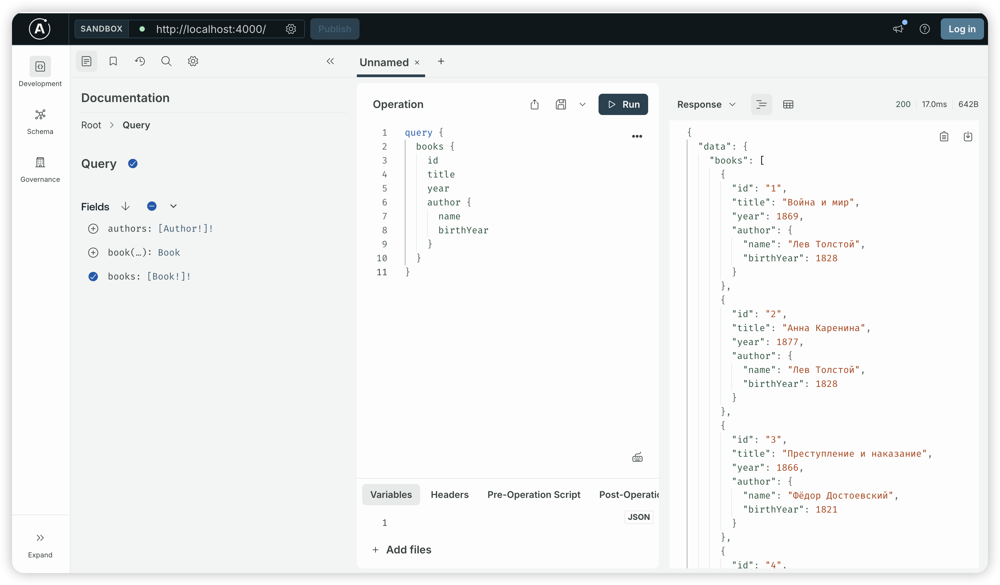
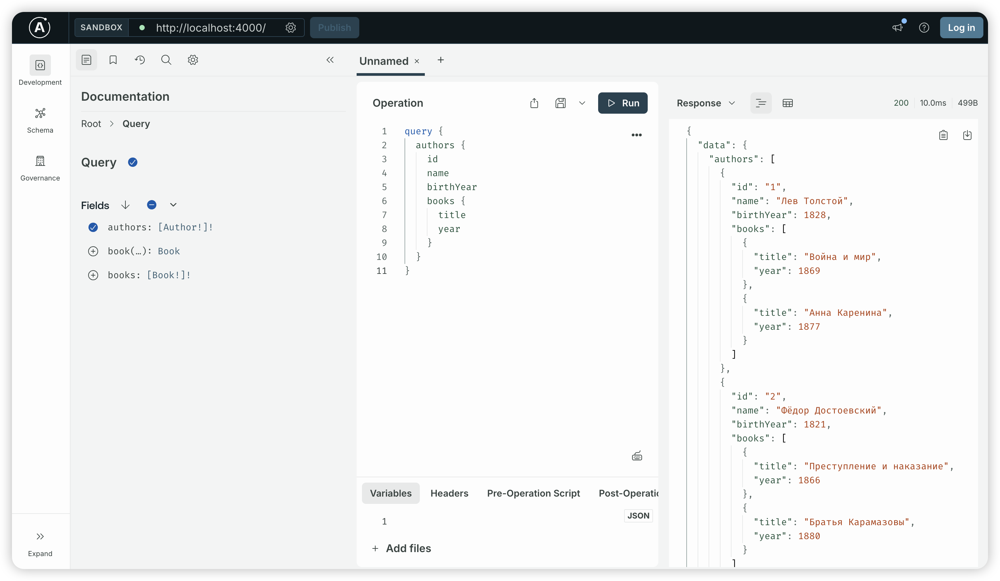
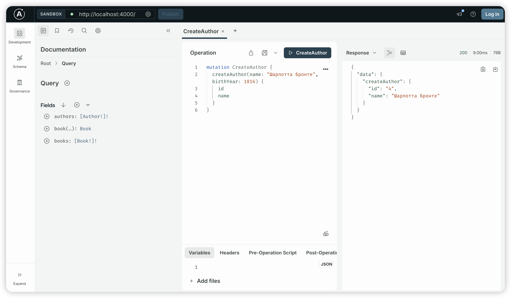
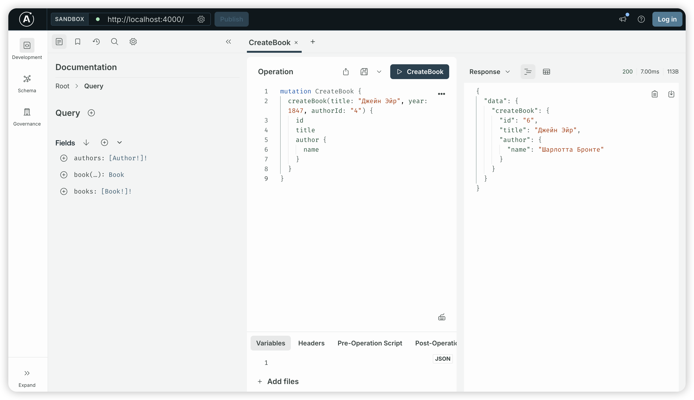
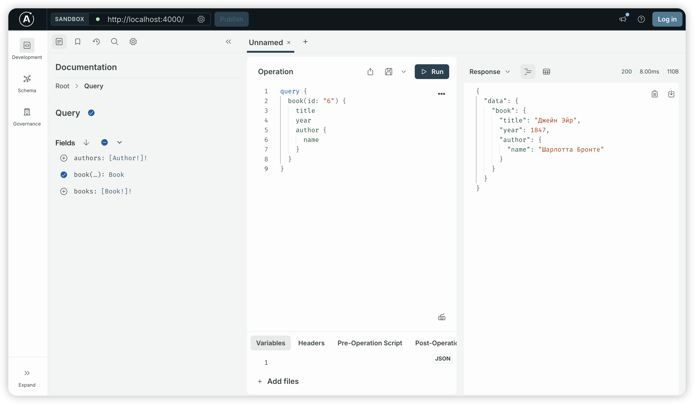

# Практическое занятие 26

Реализация GraphQL API на Apollo Server для управления каталогом книг с типами `Book` и `Author` (связь «один-ко-многим»).

## Запуск

```bash
npm install
node server.js
```

Сервер запустится на `http://localhost:4000`

## Тестирование
- Запрос 1: получение всех книг с авторами
``` graphql
query {
  books {
    id
    title
    year
    author {
      name
      birthYear
    }
  }
}
```


- Запрос 2: получение всех авторов с их книгами
``` graphql
query {
  authors {
    id
    name
    birthYear
    books {
      title
      year
    }
  }
}
```


- Запрос 3: создание нового автора 
``` graphql
mutation CreateAuthor {
  createAuthor(name: "Шарлотта Бронте", birthYear: 1816) {
    id
    name
  }
}
```


- Запрос 4: создание новой книги
``` graphql
mutation CreateBook {
  createBook(title: "Джейн Эйр", year: 1847, authorId: "4") {
    id
    title
    author {
      name
    }
  }
}
```


- Запрос 5: получение книги по id
``` graphql
query {
  book(id: "6") {
    title
    year
    author {
      name
    }
  }
}
```
